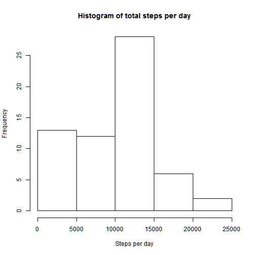
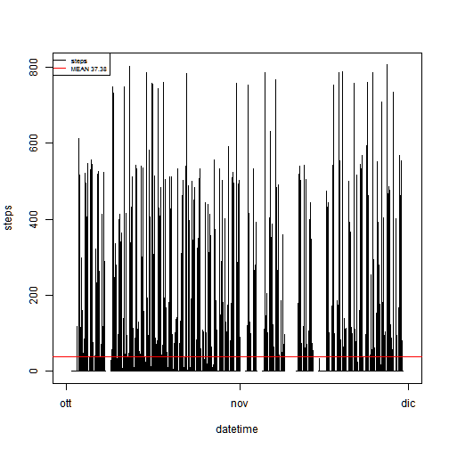
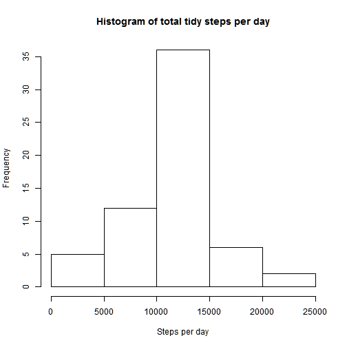
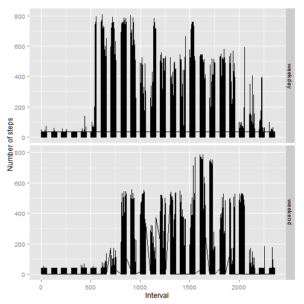

### Loading and preprocessing the data

Dataset: [Activity monitoring data][1]

[1]: https://d396qusza40orc.cloudfront.net/repdata%2Fdata%2Factivity.zip "Activity monitoring data"

NOTES: 

- We load some usefull libraries "dplyr", "ggplot2".  

- When loading the data via read.csv, all formats are fine, but the variable "date" which comes as factor; we add a variable datetime where the factor date plus the number of minutes in variable interval is converted in POSIXlt date format. 
For conversion we use a new vector "hour" in which we calculate hour as the module base 100 of interval, then from this another vector "minute"" as difference between interval and hour multiplied for 100.


```r
data = read.csv("activity.csv", sep=",", header=T, na.strings="NA")
library(dplyr); library(ggplot2);
```

```
## 
## Attaching package: 'dplyr'
## 
## The following object is masked from 'package:stats':
## 
##     filter
## 
## The following objects are masked from 'package:base':
## 
##     intersect, setdiff, setequal, union
```

```r
hour <- floor(data$interval/100)
minute <- data$interval- 100*floor(data$interval/100)
truedate <- paste(data$date, " ", hour, ":", minute, ":00", sep="")
data = data.frame(datetime = strptime(truedate, format="%Y-%m-%d %H:%M:%S"), data)
rm(hour, minute, truedate)
```

### What is mean total number of steps taken per day?

- Total number of steps taken per day


```r
steps_day =summarize(group_by(data, date), steps_per_day = sum(steps, na.rm=T))
print(steps_day)
```

```
## Source: local data frame [61 x 2]
## 
##          date steps_per_day
## 1  2012-10-01             0
## 2  2012-10-02           126
## 3  2012-10-03         11352
## 4  2012-10-04         12116
## 5  2012-10-05         13294
## 6  2012-10-06         15420
## 7  2012-10-07         11015
## 8  2012-10-08             0
## 9  2012-10-09         12811
## 10 2012-10-10          9900
## ..        ...           ...
```

- Plotting an histogram of the steps per day


```r
hist(steps_day$steps_per_day, xlab="Steps per day", main="Histogram of total steps per day")
```

 

- Mean and median of the total number of steps taken per day


```r
summary(steps_day$steps_per_day)
```

```
##    Min. 1st Qu.  Median    Mean 3rd Qu.    Max. 
##       0    6778   10400    9354   12810   21190
```

### What is the average daily activity pattern?

- Time series plot of steps versus time and MEAN (over all days) of steps as reference


```r
MEAN = mean(data$steps, na.rm=T)
with(data, plot(datetime, steps, type="l"))
abline(h=MEAN, col="red")
legend(x="topleft",legend=c("steps", "MEAN 37.38"), cex=0.6, pch=NA, lty=1, col= c("black", "red"))
```

 

- Finding out which interval corresponds to the maximum number of steps (MAX)


```r
MAX = as.numeric(summary(data$steps)[6])
print(paste("The interval ", filter(data, steps==MAX)$interval, " corresponds to the maximum value of ", MAX, " for the variable steps.", sep=""))
```

```
## [1] "The interval 615 corresponds to the maximum value of 806 for the variable steps."
```

### Imputing missing values

-  Total number of missing values in the dataset


```r
print(paste("The total number of missing values in the dataset is ", sum(as.numeric(is.na(data$steps))), "!", sep=""))
```

```
## [1] "The total number of missing values in the dataset is 2304!"
```

- Filling missing values & creating new dataset without missing values

        We will input the mean value of each day in place of missing values on                 each day, as accepted practice in statistical computations.
        The median should be preferred over the mean value cause the median is                 less sensitive to distribution's shape, but in our dataset the overall median of steps is zero so we will use the mean.
        For some dates all steps values are missing value, so for those dates we will set the overall MEAN of steps on NAs.
- The filling of NAs will be done on a new data frame "tidy".


```r
tidy= data
mean_steps =summarize(group_by(data, date), mean_steps = mean(steps, na.rm=T))

for(i in 1:61){ init=(i-1)*288+1; end=init+287
                
                if(is.na(mean_steps[i,2])){ 
                                                           for(j in init:end){  tidy[j,"steps"] = MEAN  }
                                                          }
                else{ 
                        for(j in init:end){  if(is.na(tidy[j, "steps"])){
                                                                                          tidy[j,"steps"] = mean_steps[i,2]
                                                                                        }
                                             else{}
                                           }
                     }
                }
```

- Histograms of the total number of steps taken each day on the new "tidy" dataset


```r
tidy_steps_day =summarize(group_by(tidy, date), steps_per_day = sum(steps))
hist(tidy_steps_day$steps_per_day, xlab="Steps per day", main="Histogram of total tidy steps per day")
```

 

- Mean and median of total number of steps taken per day calculated with the tidy set 

        

```r
summary(tidy_steps_day$steps_per_day)
```

```
##    Min. 1st Qu.  Median    Mean 3rd Qu.    Max. 
##      41    9819   10770   10770   12810   21190
```

###### These new values differ from the estimates from the raw data where calculations where made with NA removal. That is the NAs removal introduced about 10000 steps in the calculation, reshaping even the distribution of steps per day.


### Activity patterns differences between weekdays and weekends

- Setting a new variable dayofweek to discern between weekday and weekend


```r
x = weekdays(tidy$datetime)

for(i in 1:17568){
                  if(x[i]=="sabato" | x[i]=="domenica"){ x[i] ="weekend" }
                  else{ x[i]="weekday"}
                  }
tidy = data.frame(dayofweek = x, tidy)
```

- Panel plot of  average  steps versus time, averaged across all weekday or weekend


```r
plot <- ggplot( data=tidy, aes(x=interval, y=steps)) +
        geom_line() +
        labs(y = "Number of steps", x = "Interval") +
        facet_grid(dayofweek ~ .)
print(plot)
```

 

